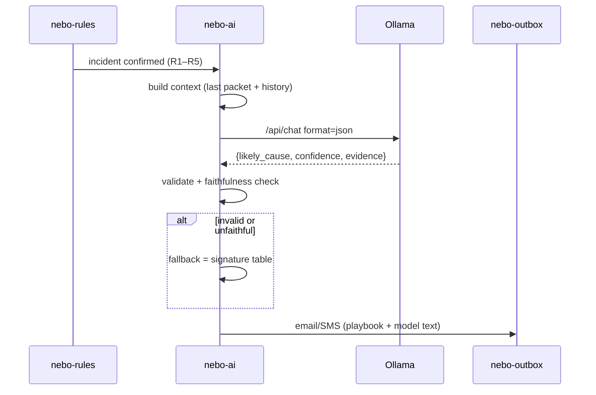

# 05 · Diagnosis pipeline (`nebo-ai`)



## Reference implementation

```python
import json, re, requests

OLLAMA = "http://127.0.0.1:11434/api/chat"
CAUSES = {"battery","panel","controller","led","radio","vandal","link","unknown"}

def signature_fallback(ctx):
    """Deterministic twin of the prompt signatures. Also used to score the model."""
    t, h = ctx["last_telemetry"], ctx["last_telemetry"]["history"]
    if ctx["incident"] == "link":                      return "link", 0.8
    if ctx["incident"] == "segment" or t["case_open"] or t["tilt_deg"] > 20: return "vandal", 0.8
    if ctx["incident"] == "lamp":                      return "led", 0.9
    if h["battery_v_max"] > 14.8:                      return "controller", 0.75
    if h["day_peak_panel_ma"][1:] == [0, 0]:           return "panel", 0.85
    if h["dawn_battery_pct"][0] - h["dawn_battery_pct"][2] > 40: return "battery", 0.8
    if h["rssi_trend_dbm"][2] < -115:                  return "radio", 0.7
    return "unknown", 0.4

def numbers_in(text):
    return set(re.findall(r"-?\d+(?:\.\d+)?", text))

def faithful(evidence, ctx):
    allowed = numbers_in(json.dumps(ctx))
    return all(numbers_in(e) <= allowed for e in evidence)

def diagnose(ctx, timeout=90):
    try:
        r = requests.post(OLLAMA, json=build_payload(ctx), timeout=timeout)
        out = json.loads(r.json()["message"]["content"])
        ok = (out.get("likely_cause") in CAUSES
              and 0 <= float(out.get("confidence", -1)) <= 1
              and isinstance(out.get("evidence"), list)
              and faithful(out["evidence"], ctx))
        if ok:
            rule_cause, _ = signature_fallback(ctx)
            out["agrees_with_rules"] = (rule_cause == out["likely_cause"])
            return out | {"source": "model"}
    except (requests.RequestException, ValueError, KeyError):
        pass
    cause, conf = signature_fallback(ctx)
    return {"likely_cause": cause, "confidence": conf, "evidence": [], "source": "fallback"}
```

## Why a fallback exists

The gateway must dispatch even if the model is slow, crashes, overheats or answers badly. The fallback table is the same logic the browser simulation uses (`diagnose()` in `dashboard.js`). When the model and the table disagree, the email shows both causes and asks the fixer to check the model's cause first.

## Measuring accuracy

When a fixer replies (for example "REPLACED PANEL RC-A-04"), `nebo-outbox` stores it in `replies`. A weekly job compares `likely_cause` with what was actually replaced, and reports accuracy per cause and per model.
