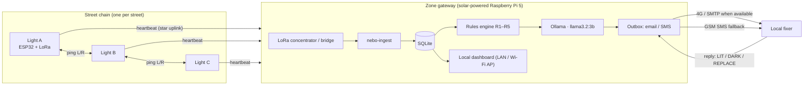

# Nebo: Nura Engineering & Infrastructure Blueprint

> **Nebo** is the engineering spec for building Nura for real, in real time, in a real street across the Sahel and East Africa (Sudan, Somalia). It covers node hardware, the neighbour-ping mesh, the zone gateway, detection logic, the offline AI pipeline, notifications, operations, security and rollout. It ends with a **logic-conflict review** of the original vision brief (§12).

| | |
|---|---|
| Status | Prototype design, v0.1 (2026-09-24) |
| Canonical rules | [`analytics/detection-rules.md`](../analytics/detection-rules.md) |
| Telemetry contract | [`analytics/telemetry-schema.json`](../analytics/telemetry-schema.json) |
| AI integration | [`ai/`](../ai/README.md) |
| Hardware | [`hardware/CASE-SPEC.md`](../hardware/CASE-SPEC.md), [`hardware/nura-case.jscad`](../hardware/nura-case.jscad) |
| Reference simulation | [`frontend/assets/js/dashboard.js`](../frontend/assets/js/dashboard.js) |

---

## 1. Design goals and non-goals

**Goals**
1. **Light at night, every night.** Target 95%+ lit-hours on priority streets.
2. **About $170 in parts and about $250 installed per light** (60-light pilot), falling with bulk buying and local assembly.
3. **Zero grid and zero cloud dependence.** Every light and the gateway run on their own solar power, and the AI runs offline.
4. **Detect → dispatch in about 3 minutes, and repair within 24 hours** by a trained local resident using hand tools.
5. **City-owned.** Open hardware, open firmware, and data on a box the city owns.

**Non-goals**
- Video, audio or people-counting. The system carries no surveillance sensors, by design and for community trust.
- Grid-tied operation, remote dimming schedules from the internet, or a vendor cloud.

---

## 2. System architecture



**Key architectural decision: neighbour pings for *mapping*, a star uplink for *reporting*.**
Each light pings its left and right neighbours, as the vision requires, and sends its heartbeat **directly** to the gateway (LoRa range 1–3 km in town). It never relays through neighbours. So when B dies, A and C can still report B's failure. Relaying through the chain would break the chain exactly when it is needed (conflict #4 in §12).

---

## 3. Light node

### 3.1 Bill of materials (per light)

| Part | Example | Est. USD |
|---|---|---|
| Solar panel + MPPT controller | SOLPERK 30 W 12 V MPPT kit | 65 |
| Battery | 12 V 12 Ah LiFePO₄ with BMS | 40 |
| Lamp | 10 W 12 V DC LED street/area lamp, IP65, IK08, ~1,200 lm, 3,000–4,000 K, rated to +60 °C | 22 |
| Lamp connector | M12 IP68 2-pin plug + socket, 2 × M6 bracket bolts | 4 |
| Compute + radio | ESP32-S3 + SX1262 LoRa (e.g. Heltec-class board) | 14 |
| DC-DC | 12 → 5 V 1 A buck, fused (node only) | 4 |
| **Power sensor** | **INA3221 3-channel shunt monitor (I²C)** | 4 |
| **Light sensor** | **BPW34 silicon photodiode + 1 MΩ load resistor** | 1 |
| Tamper + tilt | Reed switch on lid, ball tilt switch | 1 |
| Case | 3D-printed ASA (~400 g) | 9 |
| Mounting | 3-prong clamp hardware, 10 A + 2 A fuses, logic-level MOSFET, cable, glands | 7 |
| **Total** | | **≈ $171** |

Installed cost for a 60-light pilot adds shipping, import duty and fees (15–30%, $26–51), bench assembly and install labour (~2.5 person-hours, $10–30), a gateway share ($500 ÷ 60 = $8) and a 10% spares reserve ($17): **≈ $232–277 per light, "about $250"**. A new pole and foundation, only where none exists, adds $60–150.

### 3.2 Power path

```
Panel ──[fuse]──[INA3221 ch1]──► MPPT controller ──► BAT terminals ──[INA3221 ch2]──► LiFePO₄ 12 Ah
                                                          │
                                                          ├──[2 A fuse]──[INA3221 ch3]──[MOSFET, ESP32 PWM]──► 10 W 12 V LED lamp (M12 plug)
                                                          └──[1 A fuse]──► 12→5 V buck ──► ESP32 node
```

MPPT kits (the 20 W and the chosen 30 W) have **no load terminals**; only the *PWM + Load* kits do. The lamp therefore runs straight from the 12 V battery bus through a fused logic-level MOSFET that the ESP32 switches and dims with PWM. The 12→5 V buck feeds only the node (conflict #9). Channel 3 measures the lamp alone.

### 3.3 Energy budget

| Item | Value |
|---|---|
| Lamp | 10 W. Dusk to 22:00 (4 h) at 100% = 40 Wh; 22:00 to dawn (7 h) at 50% = 35 Wh. **≈ 75 Wh** |
| Node (ESP32 + LoRa, duty-cycled) | ≈ 0.25 W × 24 h ≈ **6 Wh** |
| **Daily need** | **≈ 81 Wh** |
| Harvest | 30 W × 5 peak-sun-hours × 0.8 system efficiency ≈ **120 Wh** (≈ 84 Wh with 30% dust loss) |
| Storage | 12.8 V × 12 Ah × 0.8 usable ≈ **123 Wh**: about 1.5 nights on the full schedule |
| Low-battery mode | 60% to 22:00, 30% to dawn: 24 + 21 + 6 ≈ **51 Wh/day**, about 2.4 nights |

Sahel dust events (haboob, harmattan) can cut harvest by 50–70% for days. The firmware therefore runs an **adaptive dimming** policy: if `dawn_battery_pct < 40`, the next night runs at 60/30% instead of 100/50% (51 Wh instead of 81 Wh).

### 3.4 Sensor selection (why INA3221 + photodiode)

The node has to answer three questions: *Is energy coming in? Is the battery healthy? Is the lamp actually glowing?* Four budget options were considered:

| Option | Cost | Answers | Problems in the Sahel | Verdict |
|---|---|---|---|---|
| **Current shunt monitor (INA219/INA226/INA3221)** | $2–6 module | Energy in, battery charge/discharge, lamp load: *real watts* | Needs wire termination, but the wires already terminate in the electronics bay, so there is no extra cost | ✅ **Primary** |
| **Silicon photodiode (BPW34)** | < $1 | Lamp light output; dusk/dawn | Must be shaded from neighbours and the moon (solved with a hood + blink test) | ✅ **Lamp verification** |
| Photoresistor (LDR, CdS) | ~$0.05 | Rough light/dark | Non-linear. Resistance drifts with temperature (bay can reach 60 °C+) and UV ageing. Contains cadmium (RoHS-restricted). Slow recovery after bright light | ⚠️ Fallback only |
| Irradiance / tracker module | $10–12 | Sun direction for single-axis tracking | Moving parts that sand jams. Fixed-tilt panels don't track. Adds cost with no benefit to detection | ❌ Not used |

**Why a shunt monitor beats every light sensor for the solar side:** an irradiance or light sensor tells you the *sun* is shining, not that the *panel* is producing. A cracked panel, a broken MC4 connector or a sand-caked surface all look "sunny" to a light sensor but read **0 mA** on the shunt. The panel voltage on INA3221 channel 1 also works as the day/night sensor (`>8 V` day, `<2 V` night), so the panel is its own dusk/dawn sensor.

**Why one photodiode is still needed:** channel 3 shows the lamp drawing power (≈ 740–820 mA lit, ≈ 390 mA at 50%, near 0 when dark), but an LED can draw current with failed or dirt-covered optics. The BPW34 sits in a short hood aimed at the lamp's own light pool and confirms light actually comes out. With a plain 12 V lamp (no internal battery), current and light now agree, so the two checks back each other up (conflict #10, resolved).

**The blink test:** every 10 minutes at night, the ESP32 cuts the LED for 200 ms (invisible to people) and measures `Δlux = lux_on − lux_off`. Moonlight, headlights and neighbouring lamps appear in both readings and cancel out. `Δlux < 5` ⇒ this lamp is not emitting ⇒ rule R4.

**INA3221 wiring:** I²C at `0x40`. Shunts: **ch1 panel 0.05 Ω** (±3.2 A full scale; 30 W panel peaks ≈ 1,350–1,560 mA), **ch2 battery 0.05 Ω** (charging up to ≈ 2.1 A), **ch3 lamp 0.1 Ω** (±1.6 A; lamp ≤ 0.85 A). Sample each channel every 5 s and report the averages and peaks in the 60-second packet.

### 3.5 Firmware (ESP32, Arduino-ESP32 or ESP-IDF)

```
loop every 60 s (slot = hash(node_id) mod 60 s, to spread airtime):
  read INA3221 ch1..3, photodiode, tilt, reed
  update rolling 3-day history (day_peak_panel_ma, dawn_battery_pct, battery_v_max, rssi_trend)
  ping LEFT  → wait ACK ≤ 400 ms → record ok/rssi
  ping RIGHT → wait ACK ≤ 400 ms → record ok/rssi
  send HEARTBEAT (telemetry-v1, CBOR-encoded, ≈ 90 bytes) to gateway
  lamp control: night && battery OK → PWM per dimming policy
  every 10 min at night: blink test
  deep-sleep radio between slots; always wake to answer neighbour pings in own RX window
```

- **Addressing:** each node stores `left_id` and `right_id`, provisioned with a phone over BLE at install time (see §8).
- **OTA:** firmware updates are pushed from the gateway over LoRa FUOTA, or over the Wi-Fi AP during a maintenance visit. They are signed, and rollback is on by default.

---

## 4. Radio and ping protocol

| Parameter | Value | Rationale |
|---|---|---|
| Band | 868 MHz (ITU Region 1: Sudan, Sahel) / 915 MHz where allowed | Licence-exempt ISM. **Confirm with the national regulator before deployment** |
| Modulation | LoRa SF7, BW 125 kHz | ~40 ms airtime for 20-byte pings. Street spacing is 30–50 m, and the gateway is ≤ 2 km away |
| Frames per node per minute | 2 pings + 2 ACKs + 1 heartbeat (SF9 for the uplink) | ≈ 0.3 s/min ≈ 0.5% duty cycle (EU868 limit: 1%) |
| Frame integrity | AES-128-CMAC (4-byte truncated MIC) with per-node key; `seq` counter for replay protection | Stops spoofed "I'm fine" frames from hiding sabotage |
| Ping frame | `{type=PING, from, to, seq, mic}`, 16 bytes | |
| ACK frame | `{type=ACK, from, to, seq, rssi_rx, mic}`, 17 bytes | |

**Why neighbour pings at all, if every node talks to the gateway?** The pings give the *spatial* evidence the vision asks for. Two independent witnesses (A and C) confirm B's silence, which separates a dead light from a gateway-side reception problem. They also measure link health (RSSI), which feeds the radio-fault diagnosis.

---

## 5. Zone gateway

| Component | Choice | Est. USD |
|---|---|---|
| Computer | Raspberry Pi 5, 8 GB (runs `llama3.2:3b` at ~4–6 tokens/s on CPU) | 80 |
| Storage | 128 GB NVMe or high-endurance SD | 30 |
| LoRa | SX1302 concentrator HAT (8 channels) *or* a second ESP32-LoRa as a USB bridge ($15) | 15–120 |
| Uplink | 4G USB modem + GSM SMS (Quectel EC25-class) | 45 |
| Power | 100 W panel + 12 V 50 Ah LiFePO₄ + 5 V 5 A buck | 250 |
| Enclosure | IP65 box, fan + dust filter, mounted 4 m up on a secured building | 40 |
| **Total** | | **≈ $460–565 per zone (serves 50–150 lights)** |

**Services (systemd, Python 3.11):**

| Service | Role |
|---|---|
| `nebo-ingest` | Reads frames from the LoRa bridge, verifies the MIC and replay counter, and writes to SQLite |
| `nebo-rules` | Every 60 s: evaluates R1–R5 with 3-cycle confirmation and resolution. Opens and closes incidents |
| `nebo-ai` | For each new incident, builds the prompt, calls Ollama (`http://127.0.0.1:11434/api/chat`, `format: json`), validates the output and composes the email. See `ai/` |
| `nebo-outbox` | Sends email over SMTP when 4G is available, otherwise SMS. Retries with back-off. Parses replies |
| `nebo-ui` | Local version of the dashboard, served over the gateway's Wi-Fi AP to the committee's phones |

**SQLite schema (abridged):**

```sql
CREATE TABLE nodes     (id TEXT PRIMARY KEY, zone TEXT, street TEXT, pos INT, left_id TEXT, right_id TEXT,
                        lat REAL, lon REAL, installed_at TEXT, key_id TEXT);
CREATE TABLE telemetry (node_id TEXT, ts TEXT, seq INT, json TEXT, PRIMARY KEY (node_id, seq));  -- 30-day ring
CREATE TABLE pings     (ts TEXT, from_id TEXT, to_id TEXT, ok INT, rssi INT);
CREATE TABLE incidents (id INTEGER PRIMARY KEY, key TEXT UNIQUE, type TEXT, rule TEXT, node_ids TEXT,
                        opened_at TEXT, closed_at TEXT, severity TEXT, diagnosis_json TEXT);
CREATE TABLE dispatches(id INTEGER PRIMARY KEY, incident_id INT, channel TEXT, to_addr TEXT,
                        subject TEXT, body TEXT, sent_at TEXT, status TEXT);
CREATE TABLE fixers    (id INTEGER PRIMARY KEY, zone TEXT, display_name TEXT, email TEXT, phone TEXT,
                        lang TEXT, active INT);
CREATE TABLE replies   (id INTEGER PRIMARY KEY, dispatch_id INT, received_at TEXT, raw TEXT, parsed TEXT);
```

---

## 6. Detection engine

Canonical rules: [`analytics/detection-rules.md`](../analytics/detection-rules.md). Reference implementation:

```python
CONFIRM = 3

def evaluate(street, hb, ping_ok, night, blink_delta):
    """street: ordered node ids. hb[id] -> bool. ping_ok[(a,b)] -> bool (symmetric)."""
    observed, out_idx = [], []
    for i, n in enumerate(street):
        nbs = [street[j] for j in (i - 1, i + 1) if 0 <= j < len(street)]
        live = [m for m in nbs if hb[m]]
        failed = [m for m in live if not ping_ok[key(m, n)]]
        if not hb[n] and len(failed) == len(live):
            out_idx.append(i)                                    # R1 (2 live, both fail) or R3
        elif hb[n] and night and blink_delta[n] < 5:
            observed.append(("lamp", [n]))                       # R4
    for group in consecutive_runs(out_idx):                      # R5 if len > 1
        ids = [street[i] for i in group]
        observed.append(("segment" if len(ids) > 1 else "out", ids))
    for a, b in zip(street, street[1:]):
        if hb[a] and hb[b] and not ping_ok[key(a, b)]:
            observed.append(("link", [a, b]))                    # R2
    return observed

# nebo-rules keeps pending[key] and clear[key] counters; open at CONFIRM, close at CONFIRM.
```

This is the same logic as `detect()` and `reconcile()` in the browser simulation.

---

## 7. AI pipeline (summary)

Full detail is in [`ai/`](../ai/README.md).

1. **Rules decide.** An incident exists before the model is ever called.
2. **Context pack.** The prompt carries the incident type, the rule that fired, zone priority, the street name, and the last telemetry packet with its 3-day history. No personal data goes in.
3. **Model.** `llama3.2:3b` on Ollama with `format: "json"` returns `{likely_cause, confidence, evidence[]}`. Temperature is 0.1.
4. **Guardrails.** The output is schema-validated. `likely_cause` must be in the allowed enum, and every number in `evidence` must appear in the input (anti-hallucination check). On any failure, the gateway falls back to the deterministic signature table (`ai/05-diagnosis-pipeline.md`).
5. **Email.** The steps, tools, parts and safety notes come from a **fixed, reviewed playbook** keyed by `likely_cause`. The model writes only the opening explanation and evidence, in the fixer's language. The model never invents repair steps, which matters for electrical safety.
6. **Feedback.** The fixer's reply ("replaced panel") is stored against the diagnosis to measure accuracy and tune the prompts.

---

## 8. Operations model: city-owned

| Role | Who | Does |
|---|---|---|
| **Owner** | Municipality / locality council | Owns the hardware, gateway and data. Funds the spares stock |
| **Zone committee** | Camp block committee, school parents' committee, clinic board | Chooses priority streets, vets fixers, receives weekly summaries |
| **Local fixer** | 2–4 trained residents per zone (a paid stipend is recommended) | Receives dispatches, repairs, replies |
| **Workshop** | One per city (TVET college, maker space) | Prints cases, assembles nodes, bench-tests returns |
| **Funders** | Waqf, zakat/sadaqah programmes, diaspora, OIC/ISF, city budget | Sponsor lights, streets or zones |

**Installation (per light, about 45 min, 2 people):**
1. Clamp the case onto the pole with the 3 prongs (13 mm spanner), then set the panel tilt to latitude + 5° (Khartoum ≈ 20°, Mogadishu ≈ 7°), facing south. Near the equator it can face either way.
2. Connect the battery, then the panel, then close the fuse.
3. Provision with the phone app over BLE: set `node_id`, `left_id`, `right_id`, GPS, key.
4. Wait for the "joined" purple blink and confirm both neighbours show ✓ on the local dashboard.

**Spares stock per 50 lights:** 3 batteries (12 Ah), 2 panels (30 W), 5 LED lamps (10 W, M12 plug), 3 node boards, 2 controllers, 20 fuses.

---

## 9. Security and conflict sensitivity

- **Frame authentication** (§4) stops an attacker from faking heartbeats to hide sabotage.
- **Gateway:** no inbound internet ports. Outbound SMTP/SMS only. SSH is disabled in production and allowed only through a key on the local AP. Disk encryption (LUKS) protects the fixers table.
- **Data minimisation:** the system stores no cameras, microphones or people counts. The fixers table holds only a display name, contact details and language.
- **Don't publish the map.** Outage and vandalism patterns reveal which streets are dark *right now*. That data stays on the gateway and with the committee. The public GitHub Pages site shows **simulated data only**.
- **Fixer safety:** R5 (segment) dispatches always start with "do not go alone or at night", and never name the fixer in any public channel.
- **Public site:** strict CSP (`default-src 'self'`), no third-party scripts, no network calls from the dashboard (see `claude\commands/frontend-scurity.md`).

---

## 10. Rollout plan

| Phase | Scope | Exit criteria |
|---|---|---|
| **0 · Bench** | 10 nodes + 1 gateway in the workshop | 7 days with no false R1. Every fault type (battery, panel, controller, LED, radio, link, vandal) reproduced and diagnosed correctly ≥ 8/10 times |
| **1 · Pilot street** | 1 zone, ~20 lights | 30 days, ≥ 95% lit-hours, MTTR < 24 h, fixer satisfaction survey |
| **2 · Three zones** | Refugee + education + healthcare, ~60 lights, 1 gateway | 90 days. Diagnosis accuracy ≥ 75% (measured from replies) |
| **3 · City** | 500+ lights, 5–10 gateways | Handover to city owner. Spares budget in the city plan |

---

## 11. Cost model

| Scale | Lights | Parts | Installed, excl. gateways ($224–269 per light) | Gateways | Total installed (est.) | Per light |
|---|---|---|---|---|---|---|
| Pilot street | 20 | $3,420 | $4,480–5,380 | 1 × $500 | **$4,980–5,880** | $249–294 |
| Three zones | 60 | $10,260 | $13,440–16,140 | 1 × $500 | **$13,940–16,640** | $232–277 |
| City | 500 | $85,500 | $112,000–134,500 | 6 × $500 | **$115,000–137,500** | $230–275 |

Installed per light (excl. gateway) = parts $171 + shipping/duty/fees 15–30% ($26–51) + labour $10–30 + spares 10% ($17). Bulk buying and local assembly move the city figure toward about $200 per light. New poles, where needed, are extra ($60–150 each).

A conventional grid-tied streetlight, with trenching, cabling and grid connection, typically costs an order of magnitude more per pole, and it goes dark whenever the grid does.

---

## 12. Logic-conflict review of the vision brief

> `Vison.md` was the original brief. It has since been removed from the repository; the rows below keep its name so each fix can be traced.

I checked `Vison.md`, `solution.md` and `Deployment.md` for contradictions and gaps. Each item below has a resolution that is already applied in this repository.

| # | Conflict / gap | Where | Resolution |
|---|---|---|---|
| 1 | "If street light can't ping right street **'A'**" means A pinging itself | Vison.md, View 3 | Read as **A → B** (A pings B on its right, C pings B on its left) |
| 2 | One failed link can't tell a dead light from a blocked link | Rule as written | Added **R2 link fault** (advisory, no dispatch) |
| 3 | Street-end lights have one neighbour, so "A **and** C fail" can never fire | Rule as written | **R3:** single live neighbour fails **plus** a missed gateway heartbeat |
| 4 | If lights relay reports through neighbours, B's death cuts A off from C, so nobody can report it | Implied mesh | **Star uplink:** every light sends heartbeats directly to the gateway. Pings are evidence only |
| 5 | Both links obstructed ⇒ the A+C rule false-fires on a working light | Rule as written | R1 also requires B's heartbeat to be missing. Otherwise it is 2 × R2 |
| 6 | A neighbour that is itself dead can't give evidence | Rule as written | Only **live** neighbours' failures count (truth table in `analytics/detection-rules.md`) |
| 7 | Radio alive ≠ light on: "light sensory" monitoring must see the lamp | Vison.md "key light sensory" | Photodiode + **R4 lamp fault**, and the lamp is not checked in daylight (panel-voltage day/night) |
| 8 | "Email to locals" assumes internet, which outage zones often lack | Vison.md, View 3 | Outbox with **SMS fallback** over GSM, plus a local Wi-Fi dashboard |
| 9 | **MPPT** kits (20 W and the chosen 30 W) have no load output | solution.md price list | Lamp on the 12 V battery bus through a fused MOSFET the ESP32 switches; a 12→5 V buck feeds the node only |
| 10 | The magnetic fixture had an internal battery, so load current ≠ light emitted | solution.md fixture link | **Resolved** by the lamp change (#19). Photodiode blink test stays primary; `load_ma < 50` now corroborates |
| 11 | "Ollama to understand data" vs a GitHub Pages static site | Vison.md, Deployment.md | The public site is a **simulation**. Real inference runs on the gateway (§5). Documented on the dashboard |
| 12 | An LLM deciding outages would be non-deterministic and could hallucinate | Vison.md "uses Ollama model to understand data" | **Rules decide, AI explains.** Repair steps come from a reviewed playbook, not free generation |
| 13 | Two views are both numbered "View 3" (Nura, Dashboard) | Vison.md | Four views: Home, Ummah, Nura, Dashboard |
| 14 | Slogan "Nura is light up light, create for the peole" | Vison.md | Rendered as "Light up the night. Created for the people." **Owner to confirm the wording** |
| 15 | Deployment.md says "Deploy from a branch → /root", but the site lives in `frontend/` | Deployment.md step 4 | GitHub Actions workflow publishes `frontend/`. Set Pages **Source = GitHub Actions** (see README) |
| 16 | A 3D-printed case exposed to UV and 50 °C heat can't be PLA | solution.md | ASA (preferred) or PETG, white or light grey for heat. See `hardware/CASE-SPEC.md` |
| 17 | "Owned by each city" vs dispatching to individuals | Vison.md | Fixers are registered and vetted by the zone committee. Contacts live only on the city's gateway |
| 18 | Battery reserve vs multi-day dust storms | Energy budget | 12 Ah battery: 1.5 nights on the full schedule, ≈ 2.4 in low-battery mode (§3.3). A larger battery is an option for health-zone streets |
| 19 | The magnetic kitchen light is an indoor product (not waterproof, a few hundred lumens, internal battery that degrades in heat) | solution.md fixture link | Replaced by a 10 W 12 V IP65 LED lamp (~1,200 lm) on an M12 IP68 plug. Power system resized: 30 W panel, 12 Ah battery |
| 20 | "$120 per light" was parts only | Site copy | Site shows both figures: about $170 in parts, about $250 installed (§3.1, §11) |

---

## 13. Open questions for the owner

1. **Radio regulation:** confirm 868 MHz licence-exempt use with the Sudan and Somalia telecom regulators.
2. **Fixer compensation:** volunteer, stipend, or per-repair payment? This drives MTTR more than any technology.
3. **Language per zone:** Arabic (Sudan), Somali, French (Mali, Niger, Burkina Faso, Chad, Senegal), Hausa (Nigeria, Niger).
4. **Slogan wording** (conflict #14).
5. **Pilot site:** which city and zone committee commits first?
